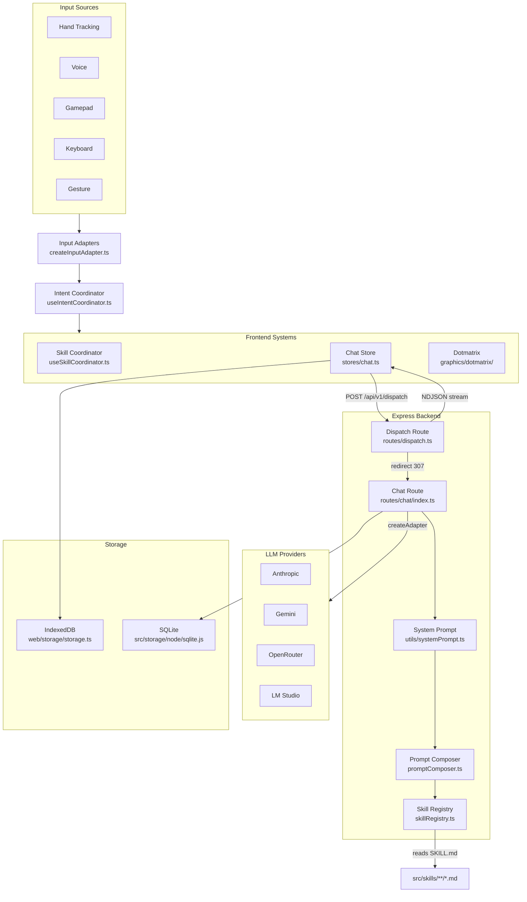
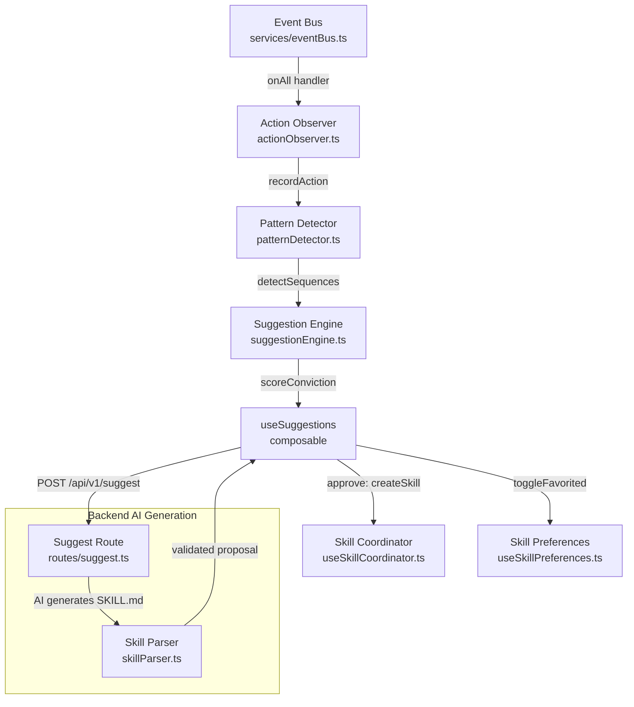
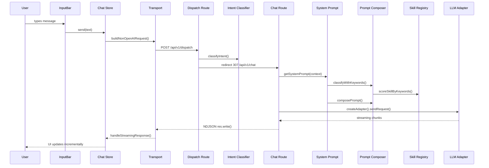
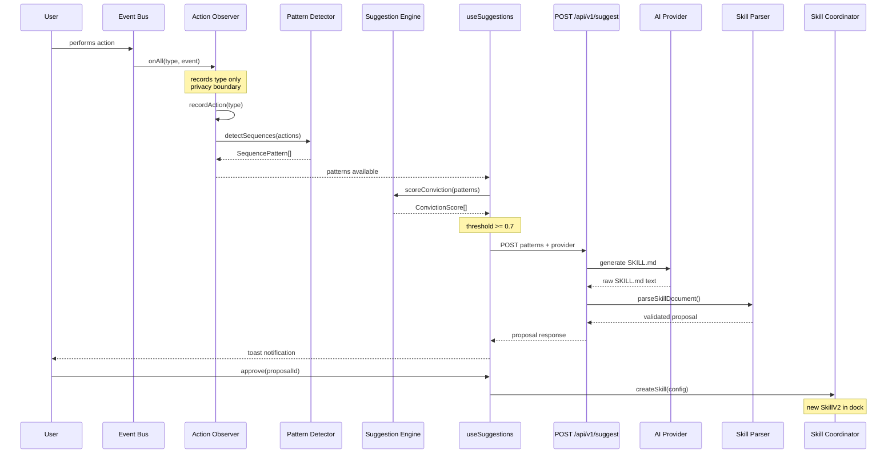
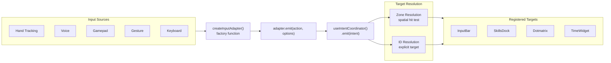

# Architecture Overview

prvctice is a productivity app combining chat AI, notes, and visual effects across a three-tier architecture: a Vue 3 single-page application frontend, an Express backend with multiple LLM provider adapters, and an Electron desktop shell for native integration. This document maps the verified connections between all major systems -- every arrow traces to an actual import, function call, or event emission in the codebase.

## System Architecture

The system divides into two main flows: the **request/response flow** (user input through chat to LLM providers and back) and the **recursive learning loop** (observing user actions, detecting patterns, and generating new skills). These flows share infrastructure (backend routes, LLM providers) but operate independently.

### Request/Response Flow

<!-- Input Sources -> Input Adapters: createInputAdapter.ts:167 factory creates adapters for hand-tracking, voice, gamepad, gesture, keyboard -->
<!-- Input Adapters -> Intent Coordinator: createInputAdapter.ts:177 emitIntent() calls useIntentCoordinator().emit() -->
<!-- Intent Coordinator -> Frontend Systems: useIntentCoordinator.ts:309 resolveTarget() dispatches to registered target handlers -->
<!-- Chat Store -> Dispatch Route: web/stores/chat.ts:624 fetch(apiResolve('/api/v1/dispatch')) POST -->
<!-- Dispatch Route -> Chat Route: src/routes/dispatch.ts:401 res.redirect(307, '/api/v1/chat') -->
<!-- Chat Route -> System Prompt: src/routes/chat/index.ts:310 getSystemPrompt(promptContext) -->
<!-- System Prompt -> Prompt Composer: src/utils/systemPrompt.ts:288 classifyWithKeywords() then :306 composePrompt() -->
<!-- Prompt Composer -> Skill Registry: src/services/promptComposer.ts:9-16 imports scoreSkillByKeywords, applyUsageBoost from skillRegistry.ts -->
<!-- Skill Registry -> SKILL.md files: src/services/skillRegistry.ts reads src/skills/agents/*.md and src/skills/playbooks/*.md -->
<!-- Chat Route -> LLM Providers: src/routes/chat/index.ts:31 createAdapter from llmProviderFactory -->
<!-- Dispatch Route -> Chat Store (NDJSON): src/routes/chat/streaming.ts:257 res.write(JSON.stringify(deltaChunk)) -->
<!-- Chat Store -> IndexedDB: web/stores/chat/conversation.ts imports from web/storage/storage.ts -->
<!-- Chat Route -> SQLite: src/routes/chat/index.ts uses backend storage for conversation persistence -->

### Recursive Learning Loop

<!-- Event Bus -> Action Observer: web/services/actionObserver.ts:116 useEventBus().onAll(handler) -->
<!-- Action Observer -> Pattern Detector: web/services/actionObserver.ts:16 imports detectSequences from patternDetector.ts -->
<!-- Pattern Detector -> Suggestion Engine: web/services/patternDetector.ts:105 detectSequences() returns SequencePattern[] consumed by scoreConviction -->
<!-- Suggestion Engine -> useSuggestions: web/composables/useSuggestions.ts:15 imports scoreConviction from suggestionEngine.ts -->
<!-- useSuggestions -> Suggest Route: web/composables/useSuggestions.ts:253 fetch(apiResolve('/api/v1/suggest')) POST -->
<!-- Suggest Route -> Skill Parser: src/routes/suggest.ts:26 requires web/services/skills/skillParser.js parseSkillDocument -->
<!-- Suggest Route -> AI Providers: src/routes/suggest.ts:248 callProvider() from providerCaller.ts -->
<!-- useSuggestions -> Skill Coordinator: web/composables/useSuggestions.ts:409 coordinator.createSkill() -->
<!-- useSuggestions -> Skill Preferences: web/composables/useSuggestions.ts:420 prefs.toggleFavorited(skill.id) -->

## Core Flow: Chat Message Pipeline

The chat pipeline handles user messages from input through LLM processing and back. The frontend dispatches to `/api/v1/dispatch`, which classifies intent and routes to `/api/v1/chat`. The backend assembles a token-budgeted system prompt using the skill registry, then streams the LLM response back via NDJSON.

<!-- User -> InputBar: web/components/InputBar.vue dispatches to chat store -->
<!-- InputBar -> Chat Store: web/stores/chat.ts:803 send(rawText) -->
<!-- Chat Store -> Transport: web/stores/chat.ts:600 buildNonOpenAIRequest() from dispatchers/nonOpenai.ts -->
<!-- Transport -> Dispatch Route: web/stores/chat.ts:624 fetch(apiResolve('/api/v1/dispatch')) POST -->
<!-- Dispatch Route -> Intent Classifier: src/routes/dispatch.ts:202 classifyIntent() -->
<!-- Dispatch Route -> Chat Route: src/routes/dispatch.ts:401 res.redirect(307, '/api/v1/chat') -->
<!-- Chat Route -> System Prompt: src/routes/chat/index.ts:310 getSystemPrompt(promptContext) -->
<!-- System Prompt -> Prompt Composer: src/utils/systemPrompt.ts:288 classifyWithKeywords() then :306 composePrompt() -->
<!-- Prompt Composer -> Skill Registry: src/services/promptComposer.ts imports scoreSkillByKeywords from skillRegistry.ts -->
<!-- Chat Route -> LLM Adapter: src/routes/chat/index.ts:31 createAdapter from llmProviderFactory -->
<!-- LLM Adapter -> Chat Route: streaming chunks via adapter.streamChat() -->
<!-- Chat Route -> Transport: src/routes/chat/streaming.ts:257 res.write(JSON.stringify(deltaChunk)) NDJSON -->
<!-- Transport -> Chat Store: web/stores/chat.ts:636 onStreamingResponse(r) -> streaming.ts handleStreamingResponse -->

## Core Flow: Recursive Learning Pipeline

The learning pipeline runs entirely in the frontend, calling the backend only for AI generation. The action observer passively records event types (never payloads) from the event bus. The pattern detector runs n-gram analysis over the action history. The suggestion engine scores patterns by conviction (frequency 50%, recency 30%, consistency 20%, minus dismissal penalties). When conviction exceeds 0.7, the system generates a SKILL.md proposal via the backend AI endpoint and presents it to the user as a toast notification.

<!-- User -> Event Bus: user actions emit typed events via useEventBus().emit() -->
<!-- Event Bus -> Action Observer: web/services/actionObserver.ts:116 useEventBus().onAll(handler) -->
<!-- Action Observer recordAction: web/services/actionObserver.ts:81 recordAction() checks ACTION_ALLOWLIST, deduplicates, appends to ring buffer -->
<!-- Action Observer -> Pattern Detector: web/services/actionObserver.ts:16 imports detectSequences from patternDetector.ts -->
<!-- Pattern Detector detectSequences: web/services/patternDetector.ts:105 pipeline: filter age -> segment -> dedup -> n-gram count -> filter -> sort -->
<!-- useSuggestions -> Suggestion Engine: web/composables/useSuggestions.ts:15 imports scoreConviction from suggestionEngine.ts -->
<!-- scoreConviction: web/services/suggestionEngine.ts:103 frequency(50%) + recency(30%) + consistency(20%) - dismissal penalty -->
<!-- useSuggestions -> Suggest Route: web/composables/useSuggestions.ts:253 fetch(apiResolve('/api/v1/suggest')) POST -->
<!-- Suggest Route -> AI Provider: src/routes/suggest.ts:248 callProvider() from providerCaller.ts -->
<!-- Suggest Route -> Skill Parser: src/routes/suggest.ts:26 requires skillParser.js parseSkillDocument -->
<!-- useSuggestions approve: web/composables/useSuggestions.ts:381 approve(proposalId) -->
<!-- useSuggestions -> Skill Coordinator: web/composables/useSuggestions.ts:409 coordinator.createSkill() -->

## Core Flow: Input-to-Intent Resolution

All input sources (hand tracking, voice, gamepad, gesture, keyboard) are normalized through input adapters. Each adapter calls `useIntentCoordinator().emit()`, which resolves the target either spatially (zone-based hit testing with grace distance) or by explicit ID. This decouples input sources from target components -- any input can drive any target.

<!-- Input Sources -> createInputAdapter: web/adapters/createInputAdapter.ts:167 factory function accepts source string or AdapterConfig -->
<!-- createInputAdapter -> adapter.emit: web/adapters/createInputAdapter.ts:175 emitIntent() wraps useIntentCoordinator().emit() -->
<!-- adapter.emit -> useIntentCoordinator: web/adapters/createInputAdapter.ts:177 calls useIntentCoordinator().emit({source, action, target, position, value}) -->
<!-- useIntentCoordinator -> Zone Resolution: web/composables/useIntentCoordinator.ts:204 spatial intent with position triggers zone-based candidate scoring -->
<!-- useIntentCoordinator -> ID Resolution: web/composables/useIntentCoordinator.ts:195 non-spatial intent with explicit target does direct map lookup -->
<!-- Zone Resolution -> Targets: web/composables/useIntentCoordinator.ts:217-231 candidates sorted by inside-zone then distance, dispatched to handler -->
<!-- ID Resolution -> Targets: web/composables/useIntentCoordinator.ts:197 map.get(intent.target).handler(intent) -->

## Code Path References

Every diagram arrow in this document is backed by a verified code path. This table consolidates all references for quick lookup.

| Connection                            | Source File                               | Target File                               | Mechanism                                                                                    |
| ------------------------------------- | ----------------------------------------- | ----------------------------------------- | -------------------------------------------------------------------------------------------- |
| Input Sources -> Input Adapters       | Various input sources                     | `web/adapters/createInputAdapter.ts`      | Factory function at :167                                                                     |
| Input Adapters -> Intent Coordinator  | `web/adapters/createInputAdapter.ts`      | `web/composables/useIntentCoordinator.ts` | `emitIntent()` calls `useIntentCoordinator().emit()` at :177                                 |
| Intent Coordinator -> Targets         | `web/composables/useIntentCoordinator.ts` | Registered target handlers                | `resolveTarget()` at :191 with zone/ID dispatch at :326                                      |
| Chat Store -> Dispatch Route          | `web/stores/chat.ts`                      | `src/routes/dispatch.ts`                  | `fetch(apiResolve('/api/v1/dispatch'))` at :624                                              |
| Dispatch Route -> Intent Classifier   | `src/routes/dispatch.ts`                  | `src/services/intentClassifier.ts`        | `classifyIntent()` at :202                                                                   |
| Dispatch Route -> Chat Route          | `src/routes/dispatch.ts`                  | `src/routes/chat/index.ts`                | `res.redirect(307, '/api/v1/chat')` at :401                                                  |
| Chat Route -> System Prompt           | `src/routes/chat/index.ts`                | `src/utils/systemPrompt.ts`               | `getSystemPrompt(promptContext)` at :310                                                     |
| System Prompt -> Prompt Composer      | `src/utils/systemPrompt.ts`               | `src/services/promptComposer.ts`          | `classifyWithKeywords()` at :288, `composePrompt()` at :306                                  |
| Prompt Composer -> Skill Registry     | `src/services/promptComposer.ts`          | `src/services/skillRegistry.ts`           | Imports `scoreSkillByKeywords`, `applyUsageBoost` at :10-14                                  |
| Skill Registry -> SKILL.md Files      | `src/services/skillRegistry.ts`           | `src/skills/**/*.md`                      | File system reads of agents/ and playbooks/                                                  |
| Chat Route -> LLM Providers           | `src/routes/chat/index.ts`                | `src/adapters/*.ts`                       | `createAdapter` from `llmProviderFactory` at :31                                             |
| Backend -> Chat Store (NDJSON)        | `src/routes/chat/streaming.ts`            | `web/stores/chat.ts`                      | `res.write(JSON.stringify(deltaChunk))` at :257                                              |
| Chat Store -> IndexedDB               | `web/stores/chat/conversation.ts`         | `web/storage/storage.ts`                  | Storage imports for conversation persistence                                                 |
| Event Bus -> Action Observer          | `web/services/eventBus.ts`                | `web/services/actionObserver.ts`          | `useEventBus().onAll(handler)` at :116                                                       |
| Action Observer -> Pattern Detector   | `web/services/actionObserver.ts`          | `web/services/patternDetector.ts`         | Imports `detectSequences` at :16                                                             |
| Pattern Detector -> Suggestion Engine | `web/services/patternDetector.ts`         | `web/services/suggestionEngine.ts`        | `detectSequences()` at :105 returns `SequencePattern[]`                                      |
| Suggestion Engine -> useSuggestions   | `web/services/suggestionEngine.ts`        | `web/composables/useSuggestions.ts`       | `scoreConviction()` at :103 imported at :15                                                  |
| useSuggestions -> Suggest Route       | `web/composables/useSuggestions.ts`       | `src/routes/suggest.ts`                   | `fetch(apiResolve('/api/v1/suggest'))` at :253                                               |
| Suggest Route -> AI Providers         | `src/routes/suggest.ts`                   | External APIs                             | `callProvider()` from `providerCaller.ts` at :248                                            |
| Suggest Route -> Skill Parser         | `src/routes/suggest.ts`                   | `web/services/skills/skillParser.ts`      | `require('../../web/services/skills/skillParser.js')` at :26                                 |
| useSuggestions -> Skill Coordinator   | `web/composables/useSuggestions.ts`       | `web/composables/useSkillCoordinator.ts`  | `coordinator.createSkill()` at :409                                                          |
| useSuggestions -> Skill Preferences   | `web/composables/useSuggestions.ts`       | `web/composables/useSkillPreferences.ts`  | `prefs.toggleFavorited(skill.id)` at :420                                                    |
| Frontend -> Backend (Usage History)   | `web/stores/chat.ts`                      | `src/routes/chat/index.ts`                | `buildSkillUsageHistory()` aggregates `loadedSkills`, sent as `usageHistory` in request body |
| Backend -> Frontend (Skills Loaded)   | `src/routes/chat/index.ts`                | `web/stores/chat/streaming.ts`            | `skills_loaded` NDJSON chunk at :527, stored as `loadedSkills` on assistant message          |

---

_Last verified: 2026-02-23_
